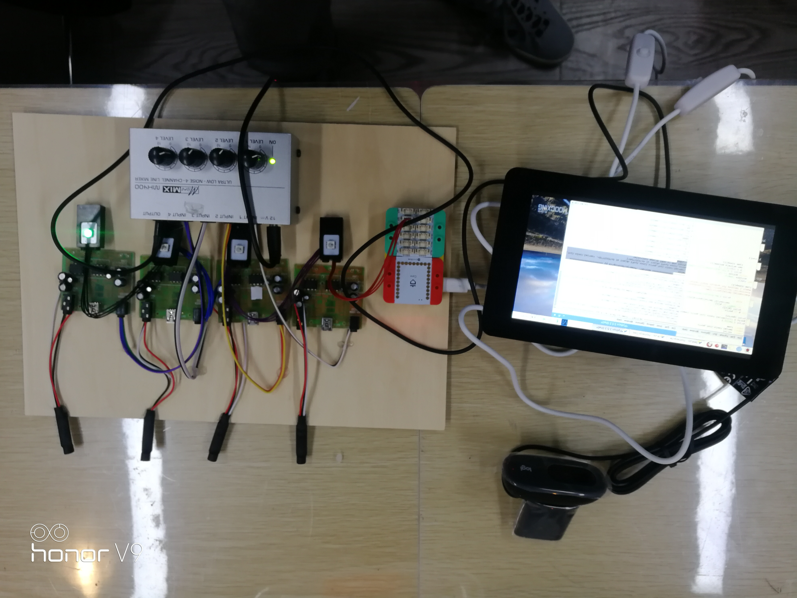

# 基于YOLOYOLO算法和深度学习的乐器声音增强麦克风阵列

# 简介

在学校的才艺表演晚会中，在表演者较多又声音有限的情况下，每人持一麦克风会导致舞台效果不美观、调音不方便。且麦克风数量可能不够，影响表演。因此想研制一种能识别演奏者的智能麦克风阵列，位于舞台中央，自动调大目前正在演奏的表演者方向的麦克风音量。

本项目使用摄像头配合人工智能算法来识别演奏者和乐器，增强指定目标方向的声音和清晰度，并消弱其他方向的声音，突出特定表演者，避免以往设备只靠声音检测稳定性和可靠性较差的问题，让舞台有更好的效果。

本项目创新点有：
1.麦克风阵列与摄像头配合完成声音增强  
2.利用人工智能YOLO算法检测演奏者  
3.利用深度学习中的CNN算法训练并识别乐器  
4.利用Arduino与树莓派结合完成音量调节整体子系统

#  制作过程
## 1.分析需求，作品构思，用3D建模呈现构思

   经过反复论证，物体上智能麦克风阵列的使用原理3D示意图如下：
  
  麦克风阵列位于舞台中央，中间有一个摄像头，面对舞台中的演奏者，其中拿乐器的重点关注，指向拿乐器的人的麦克风提高音量增益。

## 2.系统框图设计

 考虑到麦克风阵列的增益调节与人工智能算法实现起来分别面向硬件和软件，我们采用了树莓派+arduino的主从式结构，树莓派上运行人工智能的Python代码，对摄像头camera输入的视频图像进行分析，识别到带乐器的人的方位信息通过串口发送给arduino。 arduino根据串口发过来的方位信息，分别指挥麦克风阵列自动增益控制器AGC（目前实现了mic1，mic2，mic3，mic4组成的4麦克风阵列）。系统框图如下：
 

## 3.软件框图设计

软件总流程主要包括图像读入，YOLO算法检测人体，深度学习CNN算法检测人体附近乐器，生成位置文件，生成串口AGC方位控制信息等。

## 6.利用YOLO算法找演奏者
   利用YOLO算法中的coco数据集，识别人体。标定出演奏者。
   
   
## 7. 修改手势识别开源算法，使之可以识别乐器  

## 8.对YOLO算法和乐器识别算法整合  

## 9.算法移植到树莓派

# 使用或试用效果：
我们对制作出的实物模型进行了测试，利用乐队演奏视频验证效果，用算法找出视频中的人与乐器，在图中用绿框框出以做标识，并在下方用绿点来表示正在收音的麦克风。试用结果表明，图像检测能自动识别人脸和乐器，若识别区域正在唱歌或演奏，则能放大该区域音量、减小其他区域音量，基本实现设计初衷，效果良好。对于光线不佳无法识别的情况，使用者也可以点击想强化收音的方向以改变收音的摄像头。由此可以达到强化某一方向的收音，降噪且提升音质的目的。

# 优点
操作便捷，可推广性强，综合能力强大。设备放在舞台中央后就不需要人照看，就可自动完成寻找演奏者，识别乐器，调整音量的效果，无需培训，任何人都能上手使用。为使用者提供便捷的工具。

# 还需进一步研究的问题
如何提升人工智能检测目标的准确率，以及在比如视频会议中用摄像头识别张嘴说话，来突出特定一方的声音，以有更好的视频体验。目前树莓派版本由于速度原因，只能运行人脸检测版本。YOLO算法+深度学习版本还只能运行在PC机上。可以考虑添加比如神经计算棒之类的加速模块，让复杂算法也可以跑在树莓派上。
